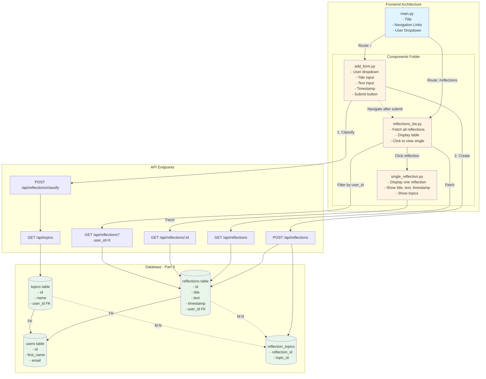

# Frontend Architecture

## Architecture Summary

### Part 2 (Frontend - Initial)
- **main.py**: Container with title, navigation links
- **components/add_form.py**: Form component (calls classify → create → navigate)
- **components/reflections_list.py**: Table view (calls get all, clickable rows)
- **components/single_reflection.py**: Detail view (calls get by id)

### Part 3 (Multi-User Extension)
- **Database**: Add `users` table, add `user_id` FK to `reflections` and `topics`
- **API**: Add user filtering to GET endpoints
- **Frontend**: User dropdown in main.py (filters all views), user dropdown in add_form.py (attribution)

## Flow
1. User selects user → filters all views
2. User fills form → classifies topics → creates reflection → navigates to list
3. User views list → clicks item → views single reflection
