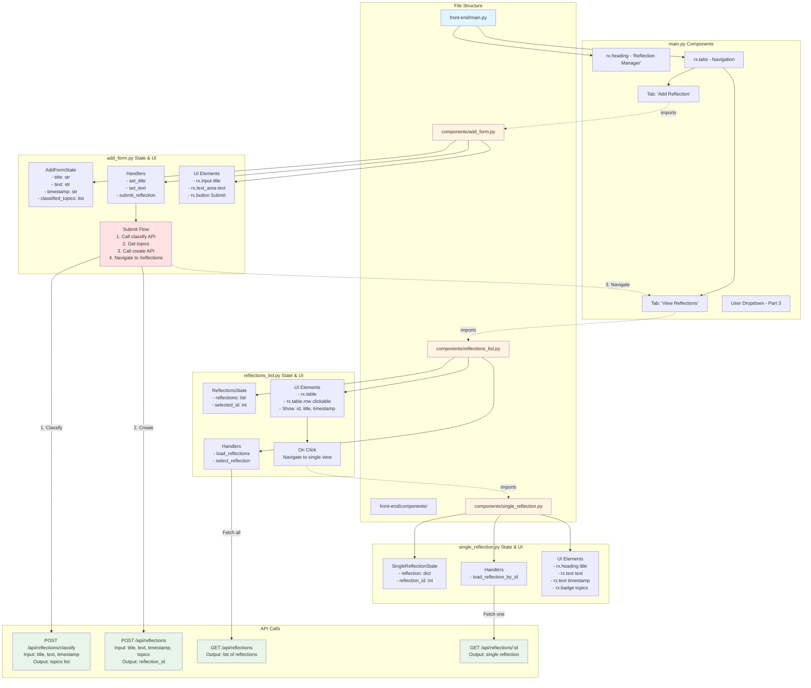

# Frontend Architecture - Detailed Implementation



## Implementation Plan

### 1. main.py
```python
# Structure:
- Import reflex
- Import components (add_form, reflections_list, single_reflection)
- Create index page with:
  * Title
  * rx.tabs with 2 tabs:
    - Tab 1: add_form component
    - Tab 2: reflections_list component
- Create app and compile
```

### 2. components/add_form.py
```python
# State:
class AddFormState(rx.State):
    title: str = ""
    text: str = ""

    async def submit_reflection(self):
        # 1. POST to /api/reflections/classify
        # 2. Get topics from response
        # 3. POST to /api/reflections with title, text, timestamp, topics
        # 4. rx.redirect("/reflections")

# Component:
def add_form():
    return rx.form with:
        - rx.input(on_change=State.set_title)
        - rx.text_area(on_change=State.set_text)
        - rx.button(on_click=State.submit_reflection)
```

### 3. components/reflections_list.py
```python
# State:
class ReflectionsState(rx.State):
    reflections: list = []

    def load_reflections(self):
        # GET /api/reflections
        # Set self.reflections

    def select_reflection(self, id):
        # rx.redirect(f"/reflections/{id}")

# Component:
def reflections_list():
    return rx.table with:
        - rx.table.header
        - rx.foreach(State.reflections, lambda r:
            rx.table.row(
                on_click=lambda: State.select_reflection(r.id)
            ))
```

### 4. components/single_reflection.py
```python
# State:
class SingleReflectionState(rx.State):
    reflection: dict = {}

    def load_reflection(self, id: int):
        # GET /api/reflections/{id}
        # Set self.reflection

# Component:
def single_reflection():
    return rx.vstack with:
        - rx.heading(State.reflection.title)
        - rx.text(State.reflection.text)
        - rx.text(State.reflection.timestamp)
        - rx.hstack(topics as badges)
```

## Part 3 Additions (Multi-User)
- Add user dropdown to main.py
- Add user_id to AddFormState and API calls
- Filter reflections by user_id in ReflectionsState
