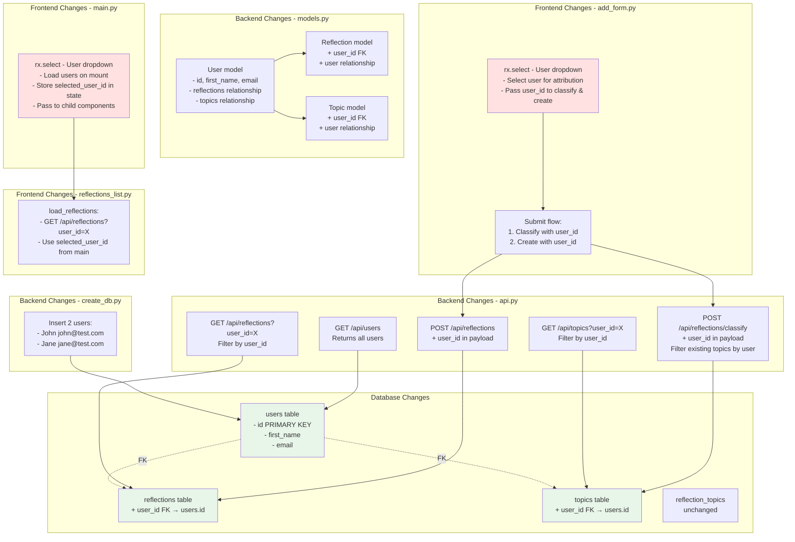

# Part 3: Multi-User Support Architecture



## Implementation Steps

### 1. Update models.py
```python
# Add User model
class User(Base):
    __tablename__ = "users"
    id = Column(Integer, primary_key=True)
    first_name = Column(String, nullable=False)
    email = Column(String, nullable=False, unique=True)
    reflections = relationship("Reflection", back_populates="user")
    topics = relationship("Topic", back_populates="user")

# Update Topic model
class Topic(Base):
    # ... existing fields ...
    user_id = Column(Integer, ForeignKey("users.id"), nullable=False)
    user = relationship("User", back_populates="topics")

# Update Reflection model
class Reflection(Base):
    # ... existing fields ...
    user_id = Column(Integer, ForeignKey("users.id"), nullable=False)
    user = relationship("User", back_populates="reflections")
```

### 2. Update create_db.py
```python
# After creating tables, seed users
users_data = [
    {"first_name": "John", "email": "john@test.com"},
    {"first_name": "Jane", "email": "jane@test.com"}
]
for user_data in users_data:
    if not db.query(User).filter(User.email == user_data["email"]).first():
        db.add(User(**user_data))
db.commit()
```

### 3. Update api.py
```python
# Add GET users endpoint
@app.get("/api/users")
async def get_users():
    # Return all users

# Update GET reflections - add user_id filter
@app.get("/api/reflections")
async def get_all_reflections(user_id: int = None):
    # Filter by user_id if provided

# Update GET topics - add user_id filter
@app.get("/api/topics")
async def get_topics(user_id: int = None):
    # Filter by user_id if provided

# Update POST reflections - add user_id
class CreateReflectionInput(BaseModel):
    # ... existing fields ...
    user_id: int

# Update POST classify - add user_id
class ClassifyReflectionInput(BaseModel):
    # ... existing fields ...
    user_id: int
```

### 4. Update main.py
```python
# Add MainState with user selection
class MainState(rx.State):
    users: list = []
    selected_user_id: int = 1

    async def load_users(self):
        # GET /api/users

    def set_user(self, user_id: int):
        self.selected_user_id = user_id

# Add user dropdown to layout
rx.select(
    MainState.users,
    on_change=MainState.set_user
)
```

### 5. Update add_form.py
```python
# Add user_id field to state
class AddFormState(rx.State):
    # ... existing fields ...
    selected_user_id: int = 1

# Add user dropdown to form
# Pass user_id to classify and create API calls
```

### 6. Update reflections_list.py
```python
# Update load_reflections to accept user_id
async def load_reflections(self, user_id: int):
    # GET /api/reflections?user_id={user_id}
```

## Key Changes Summary
1. **Database**: Add users table, add user_id FK to reflections and topics
2. **API**: Add user filtering, user_id in create/classify payloads
3. **Frontend**: User dropdown in main and form, filter by selected user
